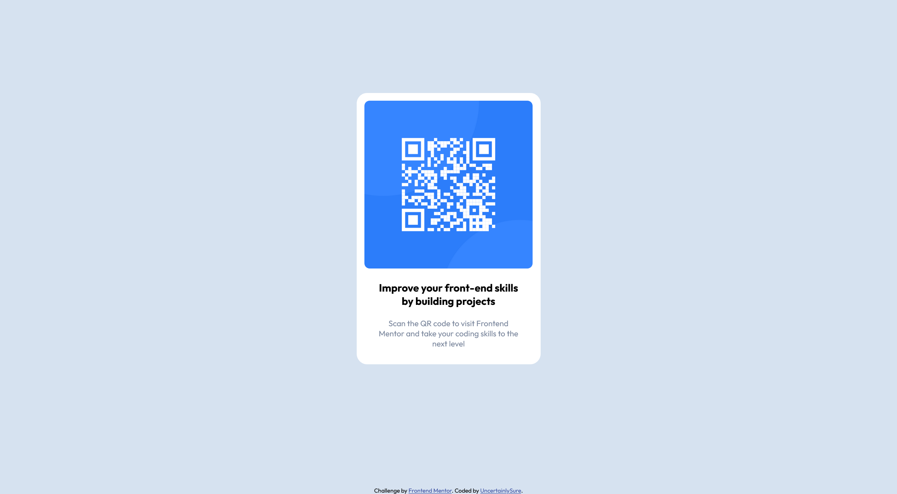

# Frontend Mentor - QR code component solution

This is a solution to the [QR code component challenge on Frontend Mentor](https://www.frontendmentor.io/challenges/qr-code-component-iux_sIO_H). Frontend Mentor challenges help you improve your coding skills by building realistic projects.

## Table of contents

- [Overview](#overview)
  - [Screenshot](#screenshot)
  - [Links](#links)
- [My process](#my-process)
  - [What I learned](#what-i-learned)
  - [Continued development](#continued-development)
  - [Useful resources](#useful-resources)
- [Author](#author)

**Note: Delete this note and update the table of contents based on what sections you keep.**

## Overview

### Screenshot



### Links

- Solution URL: [Add solution URL here](https://your-solution-url.com)
- Live Site URL: [Add live site URL here](https://your-live-site-url.com)

## My process

### Built with

- Basic HTML5
- Basic CSS3

### What I learned

```html
<body>
  <div class="qr-section">
    
    <p class="qr-first-sentence">
      Improve your front-end skills by building projects
    </p>
    <p class="qr-second-sentence">
      Scan the QR code to visit Frontend Mentor and take your coding skills to
      the next level
    </p>
  </div>

  <div class="attribution">
    Challenge by
    <a href="https://www.frontendmentor.io?ref=challenge" target="_blank"
      >Frontend Mentor</a
    >. Coded by
    <a href="https://github.com/UncertainlySure">Khanza Arrayyan</a>.
  </div>
</body>
```

```css
body {
  background-color: hsl(212, 45%, 89%);
  text-align: center;
}
.qr-section {
  background-color: hsl(0, 0%, 100%);
  border-radius: 20px;
  display: inline-block;
  padding: 15px;
  position: relative;
  margin: 10% 15%;
  width: 20rem;
}
.qr-image {
  border-radius: 10px;
  height: 20rem;
}
.qr-first-sentence,
.qr-second-sentence {
  font-family: "Outfit", sans-serif;
  margin-left: auto;
  margin-right: auto;
  width: 85%;
}
.qr-first-sentence {
  font-weight: 700;
  font-size: 20px;
}
.qr-second-sentence {
  color: hsl(220, 15%, 55%);
  font-weight: 400;
  font-size: 15px;
}
.attribution {
  font-family: "Outfit", sans-serif;
  font-size: 11px;
  position: absolute;
  left: 0;
  right: 0;
  bottom: 0;
}
.attribution a {
  color: hsl(228, 45%, 44%);
}
```

### Continued development

No changes to be planned for now. I am satisfied with the result.

### Useful resources

- [Mozilla Developer Network](https://developer.mozilla.org/en-US/) - A good resource website to look up HTML and CSS syntax quickly, if you know how to search properly.

## Author

- Frontend Mentor - [@UncertainlySUre](https://www.frontendmentor.io/profile/UncertainlySure)
